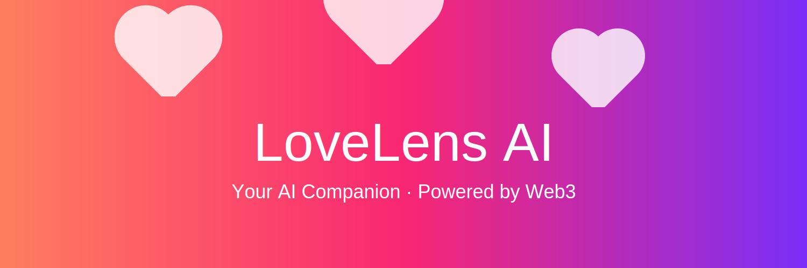
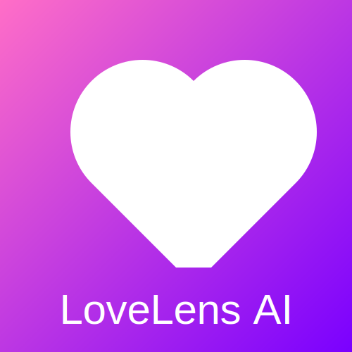

# LoveLens AI

  

## Introduction

**LoveLens AI** is your always‑available AI companion — powered by artificial intelligence and unlocked by Web3. Built with empathy and a playful spirit, LoveLens AI provides emotional support, companionship, and a touch of romance whenever you need it.

## Features

- **Empathetic Conversations:** LoveLens AI listens and responds with care and understanding.
- **Playful & Slightly Romantic Personality:** A fun, light‑hearted companion that brings joy and positivity.
- **Always Available:** Accessible 24/7 through a token‑gated chatbot interface.
- **Web3 Integration:** Unlock unlimited access with an NFT access pass on Polygon (Mumbai). Free users enjoy limited conversations.

## Mission

Our mission is to blend advanced AI companionship with the empowerment of decentralized technologies. We believe in giving users control over their data, privacy, and experiences — all while providing a supportive and engaging AI companion.

## Get Started

- **Chat with LoveLens AI:** [Chat Now](#) – Access the chatbot (coming soon).
- **Get an Access Pass:** [Buy Access Pass](#) – Mint or purchase the LoveLens AI NFT pass (coming soon).

Stay tuned for updates! We are working hard to launch the token‑gated chatbot, landing page, and marketplace links.

## Contributing

LoveLens AI is an open project. We welcome suggestions, feedback, and contributions via GitHub issues and pull requests.

## License

This project is licensed under the MIT License.
